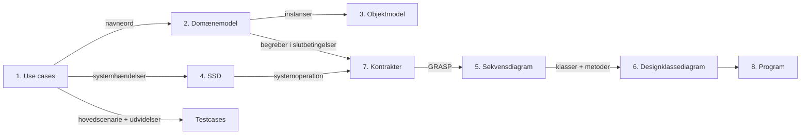
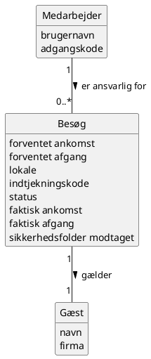
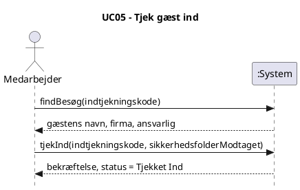
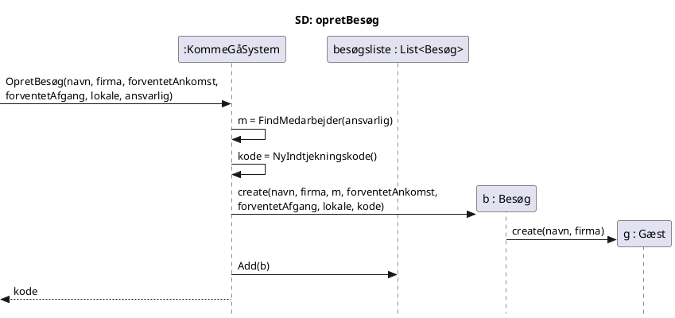
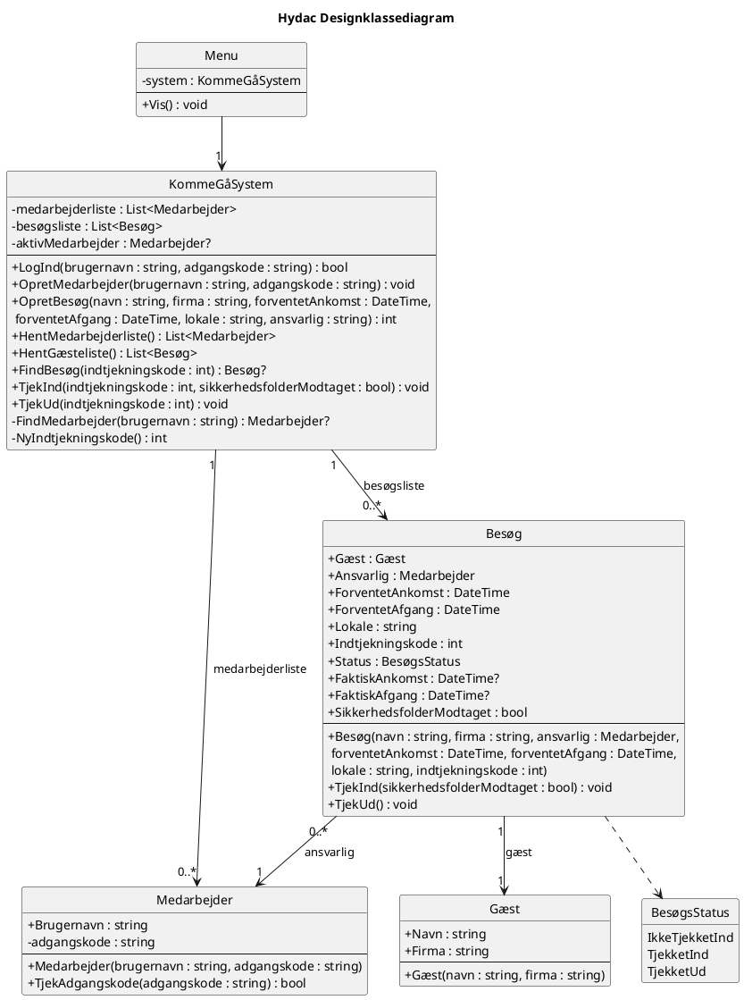

# Vejledning: fra rod til rød tråd

Rød tråd betyder to konkrete ting:

1. **Ét begreb, ét navn.** "Forventet afgang" hedder det samme i use casen, domænemodellen, SSD'en, kontrakten, designklassediagrammet og koden. Ikke "sluttid" ét sted, "afrejse" et andet og `ForventetAfgang` et tredje.
2. **Hvert artefakt er afledt af det forrige.** En censor skal kunne tage en linje i koden og følge den baglæns til en use case, og tage en use case og følge den forlæns til koden.

Ordlisten i [`Ordliste.md`](Ordliste.md) er facit for punkt 1. Resten af dette dokument handler om punkt 2.

---

## 1. Kæden



Reglerne der holder tråden samlet. Hver regel kan tjekkes mekanisk:

| Regel | Tjek |
| :---- | :---- |
| Hver systemoperation i en SSD har **samme navn og parametre** i kontrakten, som første besked i sekvensdiagrammet, og som metode på controlleren i DCD og kode. | Søg på operationsnavnet i hele repoet. Det skal dukke op i mapperne 4, 5, 6, 7 og 8. |
| Objektmodellen må kun indeholde klasser og attributter fra domænemodellen. | Sammenlign de to filer linje for linje. |
| Hver attribut, der nævnes i en kontrakts slutbetingelser, findes i domænemodellen. | Gå slutbetingelserne igennem og find hver attribut i domænemodellen. |
| Hver besked i et sekvensdiagram er en metode i DCD. Hver klasse i DCD findes i koden. | Sammenlign DCD med `.cs`-filerne. |
| Hver tilstandsændrende systemoperation har en kontrakt og et sekvensdiagram. Rene forespørgsler (vis lister) behøver ingen. | Tabellen i afsnit 4.1. |
| Hvert fagbegreb i use case-teksten står i ordlisten. | Læs use casen med ordlisten ved siden af. |

Når koden allerede findes, som hos jer, er fristelsen at rette diagrammerne til koden. Det er fint, **så længe koden opfylder use casen**. Er koden forkert (se afsnit 2), skal koden rettes, ikke diagrammerne.

---

## 2. Status: hvor tråden brister i dag

### 2.1 Begreber med flere navne

Det her er den største kilde til rod. Hver række er ét begreb, der i dag har flere navne:

| Begreb | Navne i brug i dag | Fundet i |
| :---- | :---- | :---- |
| Forventet afgang | sluttid, afgangstid, forventet afrejse, forventet afgangs tid, ank/afg tidspunkt, `ForventetAfgang` | UC02, UC04, domænemodel, objektmodel, SSD UC02, kode |
| Opret besøg | Opret besøg, Opret Gæstebesøg, Registrer besøg, `AddBesøg`, OpretBesøg | UC02, SSD, SD, kode, SOC |
| Gæsteliste | Gæsteliste, Liste Besøg, "Vis besøg", `BesøgListe`, `ListeBesøg` | UC04, kode, menu |
| **Kode** (to forskellige ting!) | Medarbejderens login-kode *og* gæstens indtjekningskode hedder begge "kode". Plus gæstID, besøgsID, medarbejderID | UC03, UC05, objektmodel, SOC, SD, kode |
| Medarbejderens identitet | navn, brugernavn, medarbejder (som attribut), medarbejderID | domænemodel, objektmodel, UC03, kode |
| Besøgets status | status (string), Status : bool, BesøgsStatus (klasse), Besøgs_Status | kode, DCD, objektmodel, SOC |
| Sikkerhedsfolder | sikkerhedsfolder modtaget, sikkerhedsfolder modtagelse, `Sikkerhedsfolder`, `SikkerhedsfolderModtaget` | domænemodel, objektmodel, kode, DCD |
| Faktisk ankomst | Indtjekning.tidspunkt, reél ankomst tid | domænemodel, objektmodel |

"Kode" er den farligste. UC03 siger "Koder vises aldrig på listen", og man kan ikke se, om det betyder adgangskoder eller indtjekningskoder. Gæstelisten i koden viser indtjekningskoden.

### 2.2 Use cases (mappe 1)

- **UC01 Opret Medarbejder er tom.** Den skal skrives.
- **Log ind mangler som use case**, selvom UC02 har "Medarbejderen er logget ind" som før-tilstand, og både kode og DCD har login.
- **UC02** nævner ikke lokale, men kode, objektmodel og DCD har lokale. Efter-tilstanden nævner ikke, at der genereres en indtjekningskode, selvom UC05 og UC06 er afhængige af den. Den beder om dato, ankomsttid og sluttid som tre felter, koden spørger om to datotider.
- **UC03** har niveau "Sub Funktion (indgår i UC02)", men UC02 henviser aldrig til den. Udvidelserne taler om søgning på navn, som hovedscenariet ikke indeholder.
- **UC04** har udvidelser om "valgt dato" og datoformat, men hovedscenariet vælger ingen dato.
- **UC06** udvidelsen "Gæsten er ikke tjekket ud ved dagens slutning" udløses ikke af aktøren i denne use case. Den er en separat hændelse og hører ikke hjemme som udvidelse her.
- **Alle use cases** har udvidelsen "Medarbejderen fortryder", men programmet har ingen måde at fortryde på.
- Filnavne: `Aktiv_UC02 ...` skiller sig ud fra de andre, og `UC04 Vis GæsteListe` mangler `.md`. Hvis "Aktiv" betyder "den use case vi fokuserer på i denne iteration", så skriv det i README i stedet for i filnavnet.

### 2.3 Domænemodel (mappe 2)

- `Besøg` har en attribut, der hedder `besøg`, og `Medarbejder` har en attribut, der hedder `medarbejder`. En klasse kan ikke have sig selv som attribut. Formentlig er det ment som id'er, og så er det et designvalg, som ikke hører hjemme i en domænemodel.
- **Multipliciteten 1 til 1 mellem Medarbejder og Besøg er forkert.** En medarbejder kan være ansvarlig for mange besøg: `1 -- 0..*`.
- Ingen associationer har navne. Uden navn ved læseren ikke, om linjen betyder "er ansvarlig for" eller "har oprettet".
- Status, lokale og indtjekningskode mangler, selvom alle use cases fra UC02 og frem bygger på dem.

### 2.4 Objektmodel (mappe 3)

Objektmodellen skal vise **instanser af domænemodellen**. I dag opfinder den nye ting:

- Klassen `BesøgsStatus` findes ikke i domænemodellen.
- `lokale` og `adgangsnøgle` findes ikke i domænemodellen. `adgangsnøgle` findes ingen andre steder overhovedet.
- Attributnavne afviger: "forventet ankomst tid", "reél ankomst tid", "sikkerhedsfolder modtagelse".
- `kode = "LH42"` på medarbejderen viser præcis kode-forvirringen fra 2.1.

### 2.5 System-sekvensdiagrammer (mappe 4)

- Navngivning af systemoperationer er uensartet: "Opret Besøg (...)" med mellemrum, "Opret Medarbejder(Navn, Kode)", "Indsætter Indtjekningskode". En systemoperation er et funktionskald: `opretBesøg(...)`.
- **UC05 og UC06 starter med en pil fra System til Medarbejder.** I en SSD er det aktøren, der starter en systemhændelse. At systemet "spørger" er brugergrænseflade og vises ikke som en operation.
- **UC06 har titlen "Tjek Gæst ind".** Copy-paste fejl.
- UC04 sender alle gæstens felter *ind* som parametre til "Vis Gæsteliste". Parametre er input. Listen er output og hører til på returpilen.
- UC02 har `loop for hver gæst`, men use casen beskriver ét besøg.
- Filnavn: `UC01 opretMedarbjeder.puml` (stavefejl).

### 2.6 Kontrakter (mappe 7)

- Der findes kun én (UC02). Der mangler kontrakter for opretMedarbejder, tjekInd og tjekUd.
- CO1 sætter `g.gæstID` til indtjekningskoden. Indtjekningskoden hører til besøget, ikke gæsten. En gæst, der kommer to gange, får to forskellige koder.
- CO1 sætter `b's Besøgs_Status`, men domænemodellen har ingen status.
- Parameternavne (ankomsttid, afgangstid) matcher ikke attributnavnene (forventet ankomst, forventet afrejse).
- Mappenavn: "Contrakt" skal være "Kontrakt".

### 2.7 Sekvensdiagram (mappe 5)

- Titlen "Registrer besøg" svarer ikke til nogen use case eller systemoperation.
- Første deltager er `:System`. I et design-sekvensdiagram er `:System` erstattet af den klasse, der modtager systemoperationen (GRASP Controller).
- `create(medarbejderID)`, `tilføjGæst`, `besøgsID` og `tidspunkt` findes hverken i DCD eller kode.
- Der er kun ét. Der skal være ét pr. kontrakt.

### 2.8 Designklassediagram (mappe 6)

- `Besøg.Firma : Firma` refererer til en klasse, der ikke findes. Firma er en tekst på `Gæst`.
- `Besøg.Status : bool` kan ikke rumme tre tilstande (Ikke Tjekket Ind, Tjekket Ind, Tjekket Ud).
- Menu har listerne, men i koden ligger de som `static` på `Besøg` og `Medarbejder`.
- `Gæst`, `TjekInd`, `TjekUd`, `TjekKode` findes i DCD men ikke i koden.
- Navne afviger fra koden: `VisMenu` vs `MenuShow`, `loggetInd` vs `erLoggetind`, `OpretBesøg` vs `AddBesøg`.

### 2.9 Kode (mappe 8)

- **Login-fejl:** løkken i `Medarbejder.Login()` sætter `erLoggetind = false` for hver medarbejder, der *ikke* matcher, også efter at én har matchet. Resultatet er, at kun den sidst oprettede medarbejder kan logge ind. Så snart I har oprettet én medarbejder, kan Admin ikke længere logge ind.
- `OpretMedarbejder` logger brugeren ud bagefter, men nulstiller ikke `aktivMedarbejder`, så navnet bliver stående i prompten.
- `AddBesøg` tjekker ikke login, selvom UC02 kræver det.
- `Convert.ToDateTime(Console.ReadLine())` crasher programmet ved forkert format. UC02 siger, at systemet skal vise en fejl.
- Ansvarlig er fri tekst. UC02 siger "Vælg en oprettet medarbejder".
- Indtjekningskoden tjekkes ikke for unikhed (CO1 kræver "ny, unik").
- **UC05 og UC06 er slet ikke implementeret.** Der er intet menupunkt til tjek ind eller tjek ud.
- Gæstelisten viser ikke dato, som UC04 kræver.
- Ingen `Gæst`-klasse, selvom domænemodel og DCD har den.
- Ubrugte `using`s (`Microsoft.VisualBasic.FileIO`, `System.Diagnostics.SymbolStore`).

### 2.10 Repo

- `bin/`, `obj/` og `.vs/` er committet. De ændrer sig hver gang nogen bygger og giver merge-konflikter, når I er flere. Se afsnit 5, trin 0.
- `.github/copilot-instructions.md` handler om Azure og har intet med projektet at gøre.
- `README.md` var tom (og gemt som UTF-16).

---

## 3. Beslutninger I skal tage først

Tag dem som gruppe, før nogen retter et diagram. Ellers retter to personer i hver sin retning. Under hver står min anbefaling og hvorfor.

**B1. Gæst som egen klasse?** Ja. Domænemodel, SOC, SD og DCD har den allerede. Kun koden mangler den.

**B2. Indtjekning og Udtjekning som egne klasser eller som attributter på Besøg?** Anbefaling: attributter på `Besøg` (`faktisk ankomst`, `faktisk afgang`, `sikkerhedsfolder modtaget`, `status`). Det giver færre klasser og en 1:1-sammenhæng fra domænemodel til kode. Vil I beholde dem som klasser i domænemodellen (det er også korrekt UP), så skal I skrive en sætning i rapporten om, at de bliver til attributter i designet, og hvorfor.

**B3. Status som tekst, bool eller enum?** Enum `BesøgsStatus { IkkeTjekketInd, TjekketInd, TjekketUd }`. Tre tilstande kan ikke være en bool, og en string kan staves forkert.

**B4. "Kode" deles i to begreber:** `adgangskode` (medarbejderens login) og `indtjekningskode` (besøgets nummer). Ordet "kode" alene bruges ikke mere. `gæstID`, `besøgsID` og `medarbejderID` udgår.

**B5. Medarbejderens identitet:** `brugernavn`. Koden og DCD bruger det allerede. Domænemodel, objektmodel og UC03 rettes.

**B6. Lokale med eller ej?** Med. Koden spørger allerede om det, og receptionen skal vide, hvor gæsten skal hen. Tilføj det til UC02 og domænemodellen. `adgangsnøgle` udgår.

**B7. Hvem modtager systemoperationerne (GRASP Controller)?** Indfør én klasse `KommeGåSystem`, der ejer listerne og har én offentlig metode pr. systemoperation. `Menu` læser input, kalder `KommeGåSystem` og skriver output. Det er den beslutning, der gør tråden synlig i koden: operationen `opretBesøg(...)` i SSD'en er bogstaveligt talt metoden `KommeGåSystem.OpretBesøg(...)`.

**B8. Hvordan vælges ansvarlig?** Lad UC02 inkludere UC03: systemet viser medarbejderlisten nummereret, og medarbejderen vælger et nummer. Det er det, I allerede har skrevet i UC03's niveau-felt, og det fjerner fejlen "den ansvarlige findes ikke", fordi man kun kan vælge eksisterende medarbejdere.

**B9. Skal gæstelisten filtreres på dato?** Anbefaling: nej, ikke i første omgang. Vis alle besøg sorteret efter forventet ankomst, med dato som kolonne. Fjern dato-udvidelserne fra UC04. Datofilter kan komme i en senere iteration.

**B10. Hvad betyder "fortryder"?** Forslag: tom indtastning (bare Enter) i et vilkårligt felt betyder fortryd og tilbage til menuen. Skriv det i den supplerende specifikation, så alle use cases kan henvise til én regel.

---

## 4. Målbillede

Det her er et forslag til, hvordan artefakterne ser ud, når tråden er på plads. Brug det som facit at rette efter, ikke som noget I skal kopiere blindt.

### 4.1 Systemoperationer

Den vigtigste tabel i projektet. Hver række går igennem alle artefakter:

| Use case | Systemoperation (SSD) | Kontrakt | SD | Metode i `KommeGåSystem` |
| :---- | :---- | :---- | :---- | :---- |
| UC07 Log ind | `logInd(brugernavn, adgangskode)` | CO1 | ja | `LogInd(...) : bool` |
| UC01 Opret medarbejder | `opretMedarbejder(brugernavn, adgangskode)` | CO2 | ja | `OpretMedarbejder(...)` |
| UC02 Opret besøg | `opretBesøg(navn, firma, forventetAnkomst, forventetAfgang, lokale, ansvarlig)` | CO3 | ja | `OpretBesøg(...) : int` (returnerer indtjekningskoden) |
| UC03 Vis medarbejderliste | `hentMedarbejderliste()` | forespørgsel | nej | `HentMedarbejderliste()` |
| UC04 Vis gæsteliste | `hentGæsteliste()` | forespørgsel | nej | `HentGæsteliste()` |
| UC05 Tjek gæst ind | `findBesøg(indtjekningskode)` | forespørgsel | nej | `FindBesøg(...) : Besøg?` |
| UC05 Tjek gæst ind | `tjekInd(indtjekningskode, sikkerhedsfolderModtaget)` | CO4 | ja | `TjekInd(...)` |
| UC06 Tjek gæst ud | `tjekUd(indtjekningskode)` | CO5 | ja | `TjekUd(...)` |

Kontrakterne er nummereret efter operation, ikke efter use case, fordi én use case kan have flere operationer.

### 4.2 Domænemodel



Ingen datatyper og ingen metoder. Det er en model af virkeligheden, ikke af koden.

### 4.3 SSD, eksempel UC05



Læg mærke til, at alle pile, der starter en hændelse, går fra aktøren. Spørgsmålet "Har gæsten modtaget sikkerhedsfolderen?" er tekst i brugergrænsefladen, ikke en systemoperation.

### 4.4 Kontrakter, eksempler

**CO3: opretBesøg**

| Felt | Indhold |
| :---- | :---- |
| Operation | `opretBesøg(navn, firma, forventetAnkomst, forventetAfgang, lokale, ansvarlig)` |
| Krydsreferencer | UC02 Opret besøg. SSD UC02. |
| Forudsætninger | Medarbejderen er logget ind. Der findes en Medarbejder *m* med *m*.brugernavn = *ansvarlig*. |
| Slutbetingelser | 1. En Gæst-instans *g* blev oprettet. 2. *g*.navn og *g*.firma blev sat til *navn* og *firma*. 3. En Besøg-instans *b* blev oprettet. 4. *b*.forventet ankomst, *b*.forventet afgang og *b*.lokale blev sat fra parametrene. 5. *b*.indtjekningskode blev sat til en ny, unik værdi. 6. *b*.status blev sat til Ikke Tjekket Ind. 7. *b* blev associeret med *g*. 8. *b* blev associeret med *m*. |

**CO4: tjekInd**

| Felt | Indhold |
| :---- | :---- |
| Operation | `tjekInd(indtjekningskode, sikkerhedsfolderModtaget)` |
| Krydsreferencer | UC05 Tjek gæst ind. SSD UC05. |
| Forudsætninger | Der findes et Besøg *b* med *b*.indtjekningskode = *indtjekningskode* og *b*.status = Ikke Tjekket Ind. |
| Slutbetingelser | 1. *b*.status blev sat til Tjekket Ind. 2. *b*.faktisk ankomst blev sat til det aktuelle tidspunkt. 3. *b*.sikkerhedsfolder modtaget blev sat til *sikkerhedsfolderModtaget*. |

Tjek selv: hvert ord i kursiv efter "*b*." står i domænemodellen i 4.2.

### 4.5 Sekvensdiagram, eksempel opretBesøg



GRASP-begrundelser, der skal stå i rapporten:
- **Controller:** `KommeGåSystem` modtager systemoperationen, fordi den repræsenterer hele systemet (facade controller).
- **Creator:** `KommeGåSystem` opretter `Besøg`, fordi den indeholder besøgslisten. `Besøg` opretter `Gæst`, fordi et besøg indeholder sin gæst (det var jeres oprindelige idé, og den holder).
- **Information Expert:** `KommeGåSystem` finder medarbejderen og laver en unik kode, fordi den kender alle medarbejdere og besøg.

### 4.6 Designklassediagram



Sammenlign med domænemodellen: samme tre fagklasser, samme attributter (nu med typer og C#-navne), plus `Menu`, `KommeGåSystem` og `BesøgsStatus`, som er designklasser. Associationspilene har retning, fordi DCD viser, hvem der kender hvem i koden.

### 4.7 Kode: de konkrete rettelser

**Login-fejlen** (ret den først, den er en rigtig bug):

```csharp
Menu.erLoggetind = false;
foreach (Medarbejder m in MedarbejderListe)
{
    if (m.Brugernavn == brugernavn && m.Kode == kode)
    {
        Menu.erLoggetind = true;
        Menu.aktivMedarbejder = brugernavn;
        break;
    }
}
```

**Datoer uden crash** (opfylder UC02's udvidelse om forkert format):

```csharp
using System.Globalization;

DateTime forventetAnkomst;
Console.Write("Forventet ankomst (dd-MM-yyyy HH:mm): ");
while (!DateTime.TryParseExact(Console.ReadLine(), "dd-MM-yyyy HH:mm",
           CultureInfo.InvariantCulture, DateTimeStyles.None, out forventetAnkomst))
{
    Console.Write("Forkert format. Eksempel: 08-10-2026 09:00: ");
}
```

**Status som enum:**

```csharp
public enum BesøgsStatus { IkkeTjekketInd, TjekketInd, TjekketUd }
```

**Unik indtjekningskode:**

```csharp
int kode;
do
{
    kode = rnd.Next(100_000, 1_000_000);
} while (besøgsliste.Any(b => b.Indtjekningskode == kode));
```

Seks cifre er rigeligt og hurtigere at taste i receptionen end otte (UC05: "skal kunne gennemføres hurtigt").

**Tjek ind på Besøg** (Information Expert: besøget kender sin egen status):

```csharp
public void TjekInd(bool sikkerhedsfolderModtaget)
{
    if (Status != BesøgsStatus.IkkeTjekketInd)
        throw new InvalidOperationException("Besøget er ikke klar til tjek ind.");

    Status = BesøgsStatus.TjekketInd;
    FaktiskAnkomst = DateTime.Now;
    SikkerhedsfolderModtaget = sikkerhedsfolderModtaget;
}
```

Sammenlign med CO4 i 4.4: forudsætningen bliver til `if`-tjekket, og hver slutbetingelse bliver til én linje. Det er den røde tråd fra kontrakt til kode, og det er værd at vise i rapporten med netop dette eksempel.

---

## 5. Arbejdsrækkefølge

Ret i denne rækkefølge. Hvert trin bruger det forrige som facit, så man ikke retter det samme to gange.

- [ ] **Trin 0. Ryd repoet.** Kør i roden af repoet:
  ```
  dotnet new gitignore
  git rm -r --cached "8. Program/HydacSoln/Hydac/bin" "8. Program/HydacSoln/Hydac/obj" "8. Program/HydacSoln/.vs" "8. Program/.vs"
  git commit -m "Fjern build-filer fra git"
  ```
  Slet `.github/copilot-instructions.md`. Brug `git mv` til omdøbninger, så historikken følger med (`UC01 opretMedarbjeder.puml`, `UC04 Vis GæsteListe` uden `.md`, `7. System Operations Contrakt`).
- [ ] **Trin 1. Godkend ordlisten** og beslutningerne i afsnit 3 som gruppe. Ret ordlisten, hvis I vælger anderledes end jeg foreslår.
- [ ] **Trin 2. Use cases.** Skriv UC01 og UC07 Log ind. Ret UC02 til UC06 med ordlistens ord, og fjern udvidelser, der ikke passer til hovedscenariet. Tegn use case-diagrammet (se afsnit 6).
- [ ] **Trin 3. Domænemodel** efter 4.2.
- [ ] **Trin 4. Objektmodel.** Kun klasser og attributter fra trin 3. Vis gerne et besøg med status Tjekket Ind, så faktisk ankomst og sikkerhedsfolder har værdier.
- [ ] **Trin 5. SSD'er.** Én pr. use case med operationsnavnene fra 4.1.
- [ ] **Trin 6. Kontrakter** CO1 til CO5.
- [ ] **Trin 7. Sekvensdiagrammer**, ét pr. kontrakt, med GRASP-begrundelse.
- [ ] **Trin 8. DCD** udledt af sekvensdiagrammerne. Hver besked i et SD bliver til en metode.
- [ ] **Trin 9. Kode** efter DCD. Ret login-fejlen allerede nu, uafhængigt af resten.
- [ ] **Trin 10. Test.** Én testcase pr. hovedscenarie og pr. udvidelse. Kør dem manuelt og skriv resultatet.
- [ ] **Trin 11. Rød-tråd-tjek** (afsnit 7).

Fordel gerne trin 2 til 8 pr. use case i stedet for pr. diagramtype. Den, der ejer UC05, laver UC05's SSD, CO4 og SD. Så er der én person, der sikrer, at netop den tråd hænger sammen, og ordlisten sikrer, at trådene bruger samme ord.

---

## 6. Hvad opgaven mangler

Jeg har ikke jeres opgavebeskrivelse, så listen bygger på, hvad et UP-forløb efter Larman normalt forventer. Tjek den mod jeres egen opgavetekst.

**Mangler helt:**
- **Ordliste.** Lavet: [`Ordliste.md`](Ordliste.md).
- **Supplerende specifikation** (krav, der ikke hører til én use case: GDPR, datoformat, fortryd, platform). Udkast: [`Supplerende specifikation.md`](Supplerende%20specifikation.md).
- **Use case-diagram** med aktøren Medarbejder, de syv use cases, systemgrænsen "HYDACs komme-gå-system" og `<<include>>` fra UC02 til UC03.
- **UC01 Opret medarbejder** (filen er tom) og **UC07 Log ind**.
- **Kontrakter** for logInd, opretMedarbejder, tjekInd og tjekUd.
- **Sekvensdiagrammer** for de samme operationer.
- **Testcases** udledt af use cases. En simpel tabel: testnr., use case, input, forventet resultat, faktisk resultat.
- **Sporbarhedstabel**: tabellen i 4.1 er et godt udgangspunkt. Sæt den i rapporten.

**Mangler delvist:**
- **Implementering af UC05 og UC06.** Diagrammerne lover tjek ind og tjek ud, programmet kan ikke.
- **Begrundelse for designvalg.** GRASP-mønstrene i 4.5 og beslutningerne i afsnit 3 skal stå i rapporten med en sætning om hvorfor.
- **Afgrænsning.** Data gemmes kun i hukommelsen og forsvinder, når programmet lukkes. Det strider mod UC04's interessent "HYDAC vil kunne dokumentere besøg bagudrettet". Enten gemmer I til en fil (JSON er nemmest i C#), eller også skriver I det eksplicit som afgrænsning. Det må ikke stå ubesvaret.
- **README** som indgang til repoet. Lavet: forsiden peger nu ind på mapperne.

---

## 7. Rød-tråd-tjek før aflevering

Gør det med søgefunktionen i VS Code (Ctrl+Shift+F på hele mappen):

- [ ] Søg på hvert ord i ordlistens "Brug ikke"-kolonne. Der må ikke være nogen fund uden for ordlisten selv.
- [ ] Søg på hver systemoperation fra 4.1. Den skal findes i mappe 4, 7 (hvis tilstandsændrende), 5, 6 og 8.
- [ ] Hver attribut i hver kontrakts slutbetingelser står i domænemodellen.
- [ ] Objektmodellen indeholder ingen klasse eller attribut, der ikke står i domænemodellen.
- [ ] Hver klasse og metode i DCD findes i koden med præcis samme navn.
- [ ] Hver udvidelse i hver use case kan udføres i programmet, eller er bevidst fjernet fra use casen.
- [ ] Hver testcase er kørt, og resultatet står i tabellen.
- [ ] Titler i `.puml`-filer matcher filnavnet og use casens navn.
